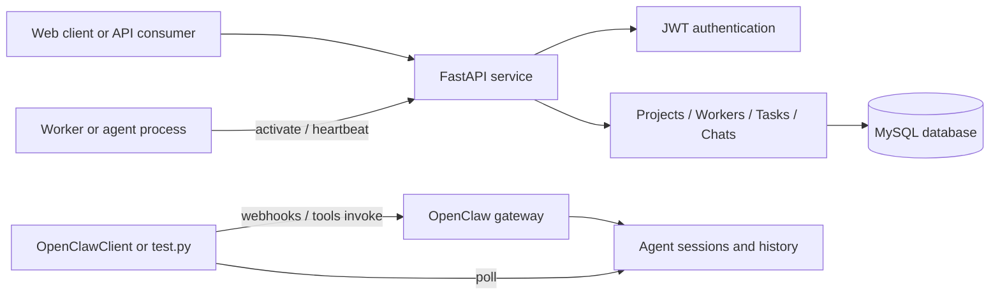

# Multi-Agent Management System

An open management layer for coordinating AI projects, workers, tasks, conversations, and agent sessions through a FastAPI service and a reusable OpenClaw client.

This project provides the operational foundation around multi-agent work: persistent project and task data, worker registration and status, authentication, task conversations, project-worker assignments, and a client for invoking agents through OpenClaw webhooks and tools.

## Overview

The system is organized around four concepts:

- **Projects** — workspaces that group related tasks and workers.
- **Workers** — agents with an agent ID, role, system prompt, capabilities, status, heartbeat interval, and concurrency limit.
- **Tasks** — units of work assigned to a project and optionally to a worker, with priority, due date, parent-task, and session fields.
- **Chats** — user, agent, and system messages associated with a task.

The backend exposes these resources through a FastAPI application backed by SQLAlchemy and MySQL. The separate `OpenClawClient` handles agent-runtime communication, so the management API and the agent gateway can evolve independently.

## Architecture



## Features

### Project and task management

- Create, list, update, and delete projects.
- Assign workers to projects through a project-worker relationship.
- Create and manage tasks with status, priority, due date, worker, and parent-task fields.
- Store task-specific chat messages and agent responses.
- Paginate and filter project, worker, task, and user listings.

### Worker management

- Register workers with an external `agent_id` and role.
- Store system prompts and JSON-encoded capabilities.
- Track online/offline/busy status and the latest heartbeat.
- Configure heartbeat intervals and maximum concurrent tasks.
- Activate a worker through an agent ID and issue a worker token.

### Authentication

- User login with JWT tokens.
- Protected management routes using `Authorization: Bearer <token>`.
- Worker token support through the `X-Worker-Token` header for worker-authenticated flows.
- Role-aware project and worker management behavior for users and administrators.

### OpenClaw integration

[`openclaw_client.py`](openclaw_client.py) provides a reusable Python client for:

- `POST /hooks/wake` to trigger a main-session heartbeat.
- `POST /hooks/agent` to start an isolated agent run.
- `POST /hooks/<name>` for mapped hooks.
- `POST /tools/invoke` for OpenClaw tool calls.
- `sessions_list` and `sessions_history` helpers.
- Synchronous agent calls implemented as webhook invocation followed by session-history polling.

The client also normalizes common response and message-content shapes, including text blocks and tool-call blocks. The standalone [`test.py`](test.py) script provides command-line checks for wake calls, asynchronous calls, synchronous calls, sessions, and session history.

## API surface

The FastAPI application is mounted at `/v1/api`.

### Management API

Management routes are under `/v1/api/frontend`:

| Area | Route prefix | Main operations |
| --- | --- | --- |
| Authentication | `/auth` | Login, profile, token check |
| Projects | `/project` | List, get, create, update, delete, assign worker |
| Workers | `/worker` | List, get, create, update, delete, heartbeat |
| Users | `/user` | List, get, create, update, delete |
| Tasks | `/task` | List, get, create, update, delete |
| Chats | `/chat` | List, create, update, delete |

### Worker activation

Worker activation is provided under `/v1/api/worker`:

```text
GET /v1/api/worker/auth/activate?agent_id=<agent-id>
```

Successful management responses use the following envelope:

```json
{
  "status": "success",
  "error_code": 0,
  "error_message": "",
  "response_data": {}
}
```

See [`docs/api-endpoints.md`](docs/api-endpoints.md) for request fields, response examples, and endpoint details.

## OpenClaw client example

```python
from openclaw_client import create_client

client = create_client(
    host="<openclaw-host>:<port>",
    hooks_token="<hooks-token>",
    gateway_token="<gateway-token>",
    timeout=30,
)

async_result = client.call_agent(
    message="Summarize the latest task updates.",
    agent_id="main",
    session_key="hook:main:example",
    deliver=False,
)

sync_result = client.call_agent_sync(
    message="Reply with exactly: SYNC_OK",
    agent_id="main",
    session_key="hook:main:sync-example",
    timeout=45,
    poll_interval=2,
)
```

For implementation notes, response-shape details, and usage examples, see [`docs/openclaw_client_readme.md`](docs/openclaw_client_readme.md).

## Quick start

### Requirements

- Python 3
- MySQL-compatible database
- OpenClaw gateway for agent-runtime features

### Install

```bash
git clone https://github.com/Createch-Rex/multi-agents-management.git
cd multi-agents-management

python3 -m venv .venv
source .venv/bin/activate
python -m pip install -r requirements.txt
```

### Configure environment variables

Runtime credentials and deployment-specific hosts are read from environment variables. Set them through the shell, a process manager, or a secret store. Do not put real values in source control.

```bash
export SYSTEM_KEY="<long-random-jwt-signing-key>"

export DATABASE_NAME="multi_agent_management"
export DATABASE_HOST="<database-host>"
export DATABASE_PORT="3306"
export DATABASE_USER="<database-user>"
export DATABASE_PASSWORD="<database-password>"

export OPENCLAW_HOST="<openclaw-host>:<port>"
export OPENCLAW_TOKEN="<gateway-token>"
export OPENCLAW_HOOKS_TOKEN="<hooks-token>"
```

`DATABASE_NAME` defaults to `multi_agent_management` and `DATABASE_PORT` defaults to `3306`. Authentication keys, passwords, and service hosts have no repository-stored credentials.

### Initialize the database

Run the migration/bootstrap helper against an isolated development database:

```bash
python migrate.py
```

The helper creates the model tables and a development administrator account. Review its bootstrap credentials before using it outside a local environment.

To load disposable sample records for local development:

```bash
python seed_demo.py
```

The demo seeder creates sample users, projects, workers, project assignments, tasks, and chat messages.

### Run the API

```bash
uvicorn main:app --host 0.0.0.0 --port 8000
```

Basic service check:

```bash
curl http://127.0.0.1:8000/health_check
```

The application serves optional static files under `/static`. A built web bundle can be served from `static/web/browser` when supplied by the deployment; the repository's primary interface is the API.

### Run OpenClaw checks

After configuring a reachable OpenClaw gateway, use a dedicated test session:

```bash
python test.py --sessions

python test.py --async \
  --message "Reply with exactly: ASYNC_OK" \
  --agent main \
  --session-key hook:main:readme-async \
  --timeout 30

python test.py \
  --message "Reply with exactly: SYNC_OK" \
  --agent main \
  --session-key hook:main:readme-sync \
  --timeout 45 \
  --poll-interval 2
```

These commands call the configured agent runtime. Check the delivery options before using them with a production agent.

## Repository layout

```text
api/                         FastAPI routers and authentication
database/                    SQLAlchemy database setup and models
docs/                        API, schema, and OpenClaw documentation
openclaw_client.py           Reusable OpenClaw webhook/tool client
test.py                      OpenClaw integration test harness
migrate.py                   Table creation and development bootstrap
seed_demo.py                 Disposable demo data seeder
config.py                    Environment-based runtime configuration
main.py                      FastAPI application entry point
```

## Documentation

- [`docs/api-endpoints.md`](docs/api-endpoints.md) — endpoint reference and request examples.
- [`docs/database-schema.md`](docs/database-schema.md) — model and table overview.
- [`docs/openclaw_client_readme.md`](docs/openclaw_client_readme.md) — OpenClaw client methods, response shapes, and integration notes.

## Security notes

- Never commit `SYSTEM_KEY`, database passwords, OpenClaw tokens, or worker tokens.
- If a credential has ever been committed, rotate it even after removing it from the latest file; old commits may still be accessible.
- Run `migrate.py` and `seed_demo.py` only against an isolated development database unless their bootstrap data has been reviewed.
- Use dedicated OpenClaw test sessions and keep `deliver=False` when validating locally.

## Current boundaries

- The management API, database models, and OpenClaw client are implemented as separate surfaces.
- OpenClaw execution is exercised through the standalone client/test harness; application-specific orchestration can be built on top of these components.
- The repository does not include provider credentials or a built-in production deployment configuration.
